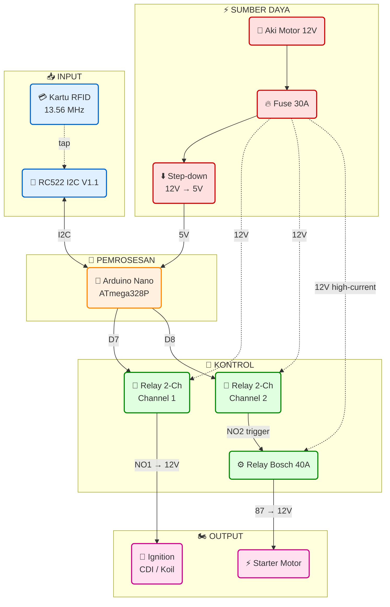
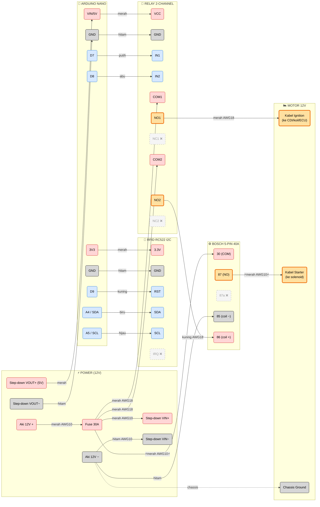
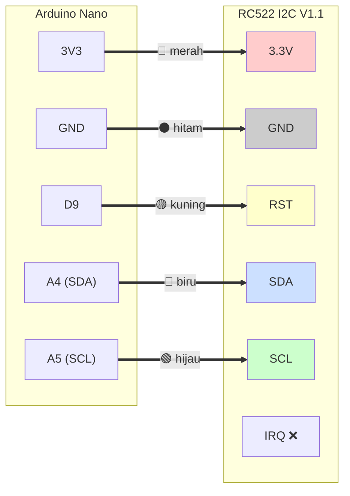
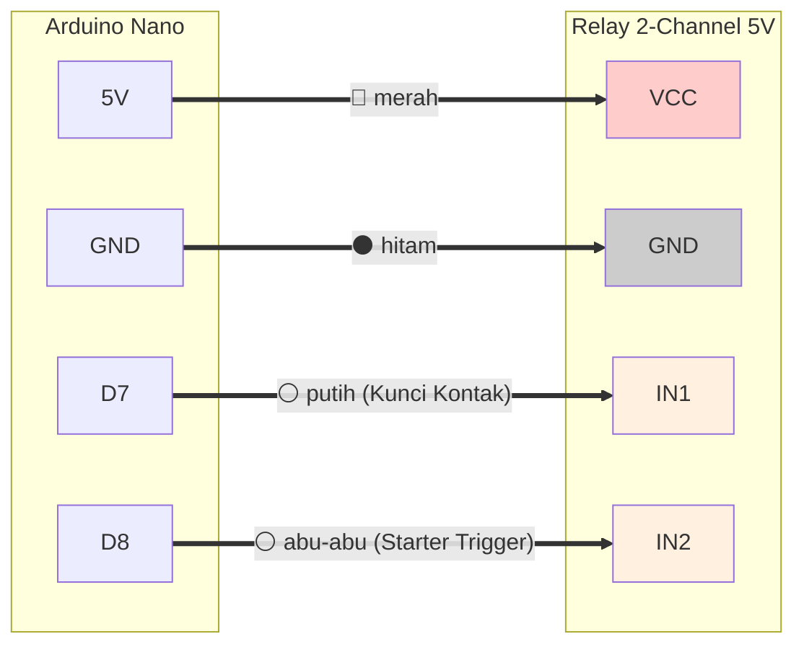
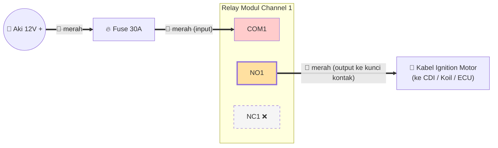
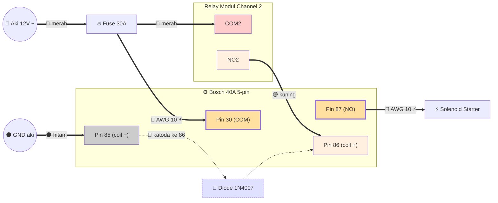
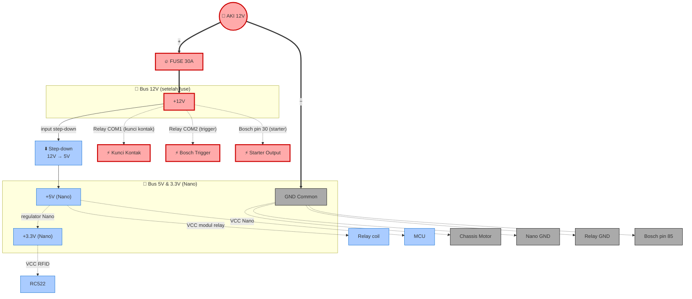
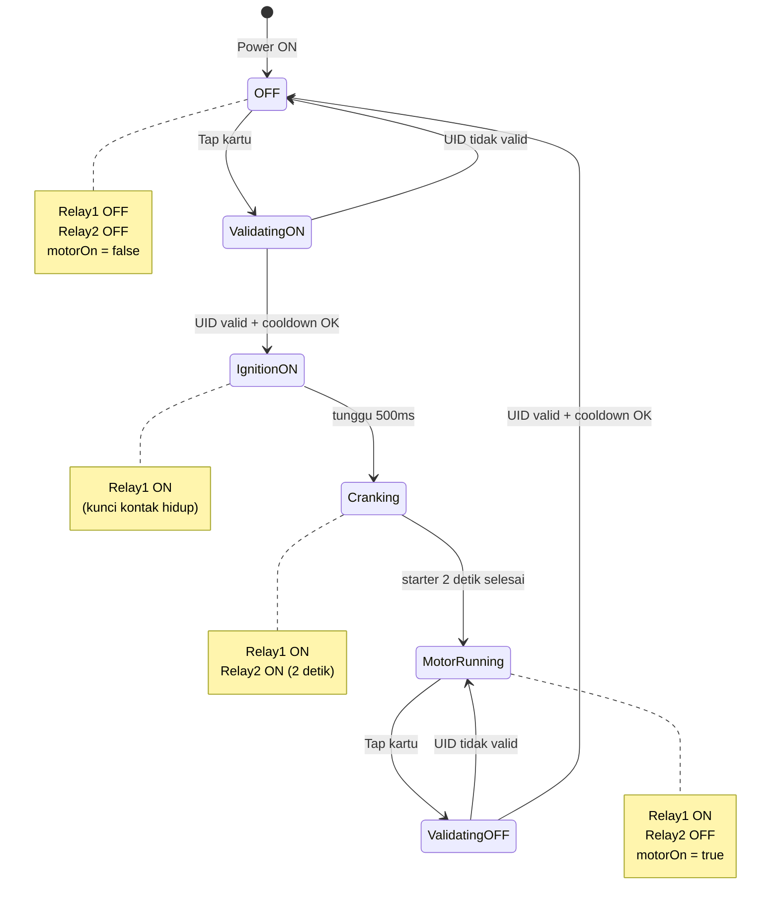
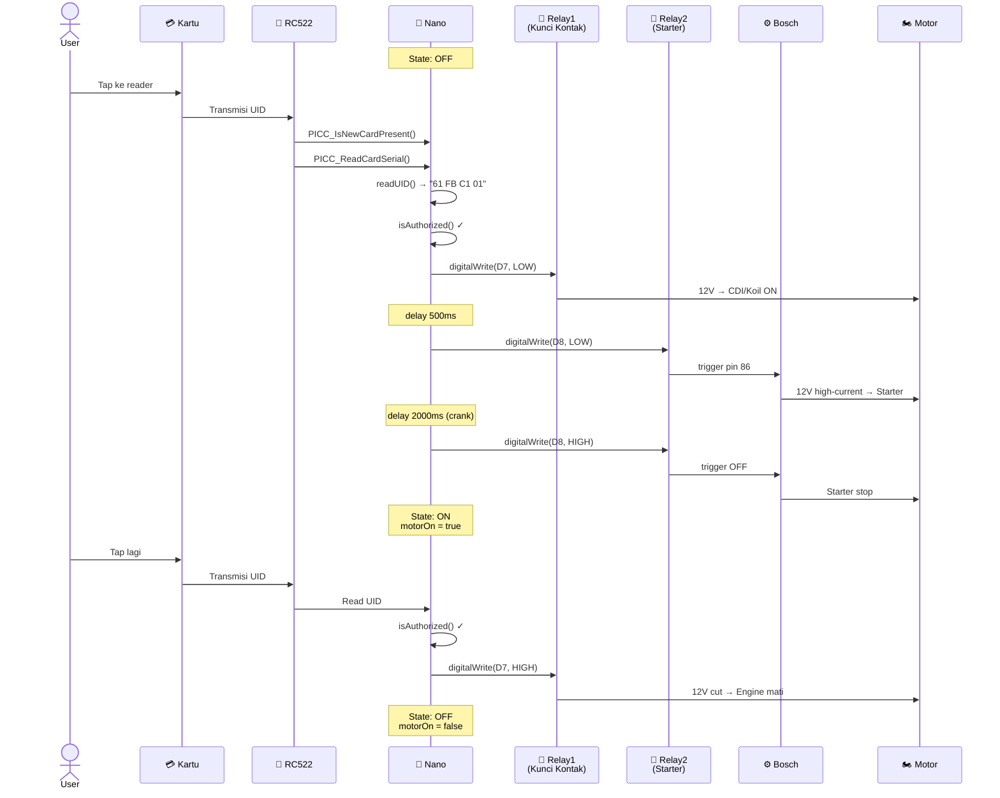
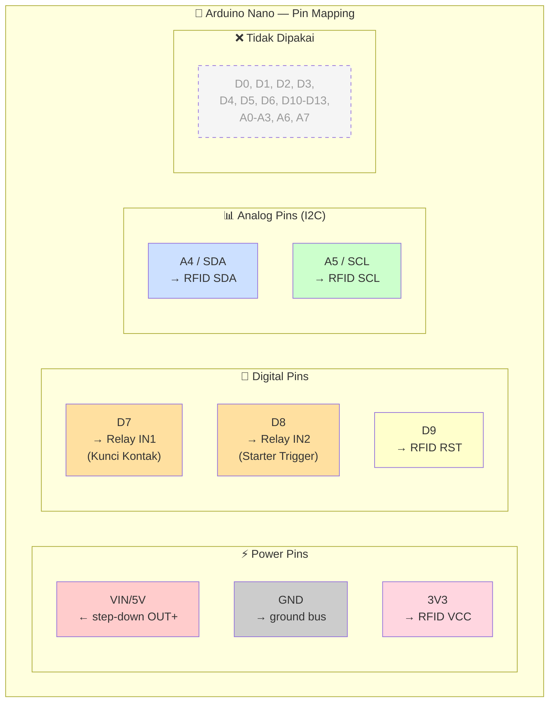

# Diagram Wiring SIKAMOT (Mermaid Detail)

> Buka file ini di **GitHub web**, **VSCode (extension Markdown Preview Mermaid Support)**, atau **Obsidian** untuk render visual otomatis.

---

## 1. Overview Sistem

---

## 2. Detail Wiring Per Pin

---

## 3. Diagram Per Modul

### 3.1 RFID → Nano (Sinyal I2C)

### 3.2 Relay 2-Channel → Nano (Sinyal Kontrol)

### 3.3 Relay Channel 1 → Ignition Motor

### 3.4 Relay Channel 2 + Bosch → Starter (Cascade)

---

## 4. Diagram Power Distribution

---

## 5. Diagram State Machine (Logika Toggle)

---

## 6. Sequence Diagram (Alur Tap Kartu Valid)

---

## 7. Mapping Pin Lengkap (Tabel + Diagram)

---

## Legenda Warna Standar

| Warna | Fungsi |
|---|---|
| 🔴 Merah | Tegangan positif (+5V, +12V, +3.3V) |
| ⚫ Hitam | Ground (GND) / negatif aki |
| 🟡 Kuning | Sinyal trigger / RST |
| 🔵 Biru | Data I2C SDA |
| 🟢 Hijau | Clock I2C SCL |
| ⚪ Putih / Abu | Sinyal kontrol relay (IN1, IN2) |
| 🟠 Oranye | High-current (AWG 10) |

---

## Cara Render Visual

| Tool | Cara |
|---|---|
| **GitHub** | Push repo → buka file `.md` di web, auto-render |
| **VSCode** | Install extension `Markdown Preview Mermaid Support` → `Ctrl+Shift+V` |
| **Obsidian** | Buka file → mode preview |
| **Online viewer** | Copy isi blok mermaid → paste di [mermaid.live](https://mermaid.live) |
| **Export PNG** | mermaid.live → tombol `Actions` → `Download PNG/SVG` |

Untuk dapat **file gambar** (PNG/SVG yang bisa di-print), pakai mermaid.live → copy diagram → export.
