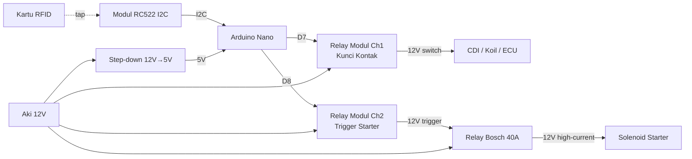

# Wiring Lengkap — SIKAMOT (Sistem Keamanan Motor)

Dokumentasi wiring untuk sketch `motor_starter.ino`.
Pasang ke **motor asli** (12V), bukan simulasi LED.

---

## Daftar Komponen

| No | Komponen | Qty | Keterangan |
|---|---|---|---|
| 1 | Arduino Nano | 1 | Otak sistem |
| 2 | Modul RFID RC522 I2C V1.1 | 1 | NET-0061 |
| 3 | Kartu/Keychain RFID 13.56 MHz | 2 | 1 utama, 1 cadangan |
| 4 | Modul Relay 2-Channel 5V | 1 | Aktif LOW |
| 5 | Relay Otomotif Bosch 5-pin 40A | 1 | Khusus untuk starter |
| 6 | Diode 1N4007 | 1 | Flyback diode relay Bosch |
| 7 | Fuse 30A + holder | 1 | Proteksi jalur utama |
| 8 | Step-down 12V → 5V | 1 | Power supply Nano dari aki |
| 9 | Kabel otomotif AWG 18-22 | secukupnya | Untuk jalur sinyal & 5V |
| 10 | Kabel otomotif AWG 10-12 | secukupnya | Untuk jalur starter (arus besar) |
| 11 | Heat-shrink tube, isolasi | — | Pelindung sambungan |
| 12 | Boks plastik/akrilik | 1 | Casing Nano + relay |

---

## Diagram Blok Sistem



---

## Tabel Wiring Lengkap

### 1. Power Supply Nano (Step-down 12V → 5V)

| Dari | Ke | Warna Kabel (saran) | Catatan |
|---|---|---|---|
| Aki 12V (+) **via fuse 30A** | Step-down VIN+ | Merah | Wajib pakai fuse |
| Aki 12V (−) / chassis ground | Step-down VIN− | Hitam | — |
| Step-down VOUT+ (5V) | Nano pin **5V** | Merah kecil | Set output step-down ke 5.0V |
| Step-down VOUT− (GND) | Nano pin **GND** | Hitam kecil | — |

> Atau pakai USB powerbank untuk testing — colok ke port mini-USB Nano.

---

### 2. RFID RC522 I2C → Nano

| Pin RFID | Pin Nano | Warna Kabel | Jalur |
|---|---|---|---|
| **3.3V** | **3.3V** | Merah | Pendek, langsung ke Nano |
| **GND** | **GND** | Hitam | Pendek, langsung ke Nano |
| **RST** | **D9** | Kuning | Pendek |
| **SCL** | **A5** | Hijau | Pendek |
| **SDA** | **A4** | Biru | Pendek |
| **IRQ** | (kosong) | — | Tidak dipakai |

> ⚠️ RFID power = **3.3V**, bukan 5V. Posisikan modul di tempat yang mudah ditap (misal di dekat speedometer atau jok).

---

### 3. Modul Relay 2-Channel → Nano

| Pin Relay | Pin Nano | Warna Kabel |
|---|---|---|
| **VCC** | **5V** | Merah |
| **GND** | **GND** | Hitam |
| **IN1** | **D7** | Putih (Kunci Kontak) |
| **IN2** | **D8** | Abu-abu (Starter Trigger) |

---

### 4. Output Relay Channel 1 (Kunci Kontak) → Motor

Memutus / menyambung listrik ke CDI / koil / ECU.
**Skenario:** ganti fungsi kunci kontak fisik.

| Dari | Ke | Warna Kabel | Catatan |
|---|---|---|---|
| Aki 12V (+) **setelah fuse** | **COM1** | Merah tebal | Power masuk relay |
| **NO1** | Kabel ignition motor (input CDI/koil) | Merah/Hitam (cek manual book) | Power keluar saat relay ON |
| **NC1** | (kosong) | — | Tidak dipakai |

> 💡 Kalau bingung cari kabel ignition: lepas kunci kontak fisik, cari kabel yang **putus arus 12V** saat kunci OFF dan **hidup** saat kunci ON.

---

### 5. Output Relay Channel 2 (Trigger Starter) → Relay Bosch

Relay modul **TIDAK boleh** langsung ke starter (arus 30-100A bisa bakar relay).
Pakai relay otomotif Bosch sebagai cascade.

| Dari | Ke | Warna Kabel | Catatan |
|---|---|---|---|
| Aki 12V (+) | **COM2** | Merah | Sumber 12V untuk trigger |
| **NO2** | Bosch pin **86** | Kuning | Sinyal trigger ke coil Bosch |
| Bosch pin **85** | GND aki | Hitam | Ground coil Bosch |
| **NC2** | (kosong) | — | — |

---

### 6. Relay Otomotif Bosch 5-pin → Starter

Bosch relay pinout standar:
- **30** = COM (input arus tinggi)
- **87** = NO (output ke beban)
- **87a** = NC (tidak dipakai)
- **85** = coil GND
- **86** = coil 12V trigger

| Dari | Ke | Warna Kabel | Catatan |
|---|---|---|---|
| Aki 12V (+) **via fuse 30A** | Bosch pin **30** | Merah TEBAL (AWG 10-12) | Sumber arus starter |
| Bosch pin **87** | Solenoid starter (+) | Merah TEBAL (AWG 10-12) | Output ke starter |
| Bosch pin **85** | GND aki / chassis | Hitam | Sudah disebut di section 5 |
| Bosch pin **86** | NO2 relay modul | Kuning | Sudah disebut di section 5 |
| Bosch pin **87a** | (kosong) | — | — |

> Tambahkan **dioda 1N4007** paralel dengan coil Bosch (pin 85 ↔ 86), katoda (garis) ke pin 86. Untuk proteksi spike tegangan saat coil de-energize.

---

### 7. Ground (Common Ground — WAJIB!)

Semua ground harus disatukan di **1 titik**:

| Komponen | Ground ke |
|---|---|
| Nano GND | Titik ground utama |
| Relay modul GND | Titik ground utama |
| Step-down VOUT− | Titik ground utama |
| Aki 12V (−) | Titik ground utama |
| Chassis motor | Titik ground utama |
| RFID GND | Sudah lewat Nano GND |

> ⚠️ Kalau ground tidak disatukan, sinyal sangat noise dan relay bisa nyala-mati sendiri.

---

## Diagram Skematik (ASCII)

```
                   ┌──────────────────┐
                   │   AKI MOTOR 12V  │
                   │  +───────────−   │
                   └───┬──────────┬───┘
                       │          │
                  [Fuse 30A]      │
                       │          │
            ┌──────────┴──────────┴────────────────────────┐
            │                                              │
            ▼                                              ▼
    ┌───────────────┐                              ┌─────────────────┐
    │  STEP-DOWN    │                              │  CHASSIS GND    │
    │  12V → 5V     │                              │ (titik ground)  │
    └──┬──────────┬─┘                              └────────▲────────┘
       │+5V       │GND                                      │
       │          └──────────────────────────────────────┐  │
       ▼                                                 │  │
   ┌───────────────────────────────────────────┐         │  │
   │            ARDUINO NANO                   │         │  │
   │  5V  GND  3.3V  D7  D8  D9  A4  A5        │         │  │
   └──┬───┬────┬─────┬───┬───┬───┬───┬─────────┘         │  │
      │   │    │     │   │   │   │   │                   │  │
      │   └────│─────│───│───│───│───│───────────────────┘  │
      │        │     │   │   │   │   │                      │
   ┌──┴──┐  ┌──┴──┐  │   │   │   │   │                      │
   │ 5V  │  │ GND │  │   │   │   │   │                      │
   │ VCC │  │ GND │  │   │   │   │   │                      │
   └──┬──┘  └──┬──┘  │   │   │   │   │                      │
      │        │     │   │   │   │   │                      │
      ▼        ▼     │   │   │   │   │                      │
   ┌──────────────────────┐ │   │   │   │                   │
   │  RELAY 2-CH MODUL    │ │   │   │   │                   │
   │  IN1 ◄───────────────┘ │   │   │   │                   │
   │  IN2 ◄─────────────────┘   │   │   │                   │
   │  COM1  NO1  COM2  NO2      │   │   │                   │
   └──┬─────┬────┬────┬─────────┘   │   │                   │
      │     │    │    │             │   │                   │
      │     │    │    └─────────► Bosch 86                  │
      │     │    │                                          │
      │     │    └──────────► +12V (dari aki via fuse)      │
      │     │                                               │
      │     └────────► Kabel ignition motor (ke CDI/koil)   │
      │                                                     │
      └──────────► +12V (dari aki via fuse)                 │
                                                            │
   ┌────────────────────────┐                               │
   │  RFID RC522 I2C        │                               │
   │  3.3V GND RST SCL SDA  │                               │
   └───┬──┬───┬───┬───┬─────┘                               │
       │  │   │   │   │                                     │
       ▼  ▼   ▼   ▼   ▼                                     │
     3.3 GND  D9  A5  A4 (Nano)                             │
                                                            │
   ┌────────────────────────────────┐                       │
   │   RELAY BOSCH 5-PIN 40A        │                       │
   │   30  87  87a  85  86          │                       │
   └───┬───┬────────┬───┬───────────┘                       │
       │   │        │   │                                   │
       │   │        └───┘─── ke GND ──────────────────────┐ │
       │   │                                              │ │
       │   └────────► Solenoid starter (+) [AWG 10]       │ │
       │                                                  │ │
       └──────► +12V via fuse 30A [AWG 10]                │ │
                                                          │ │
                                                          ▼ ▼
                                                  CHASSIS GND
```

---

## Routing Kabel — Jalur Fisik di Motor

| Segmen | Dari | Ke | Saran Jalur |
|---|---|---|---|
| 1 | Aki (+) | Fuse holder | Pendek, dekat aki |
| 2 | Fuse | Step-down + relay COM | Via jalur kelistrikan utama |
| 3 | Step-down → Nano | Step-down 5V out | Di dalam boks Nano |
| 4 | Nano → Relay modul | D7, D8, 5V, GND | Di dalam boks |
| 5 | Nano → RFID | A4, A5, D9, 3.3V, GND | Lewat kabel data ke posisi modul (jok/dashboard) |
| 6 | Relay NO1 → kabel kunci kontak | Putus jalur kunci kontak asli, sisipkan relay | Di area kunci kontak |
| 7 | Relay NO2 → Bosch 86 | Sinyal | Kabel pendek antar relay |
| 8 | Bosch 30 / 87 → Starter | Output starter | KABEL TEBAL, jalur pendek |
| 9 | Semua GND → chassis | Titik ground utama | Baut chassis (pakai sepatu kabel ring) |

---

## Cara Cari Kabel di Motor

### Kabel Kunci Kontak (Ignition)
1. Lepas cover kunci kontak fisik
2. Cabut soket kunci kontak
3. Pakai **multimeter** mode 20V DC, probe (+) ke kabel, (−) ke chassis
4. Putar kunci ke ON → kabel yang **terbaca 12V hanya saat ON** = ini target
5. Sambungkan **NO1** relay paralel dengan kabel ini (motor jalan dari kunci fisik ATAU RFID)

### Kabel Starter
1. Lepas tutup tombol starter di stang
2. Cari kabel yang **konek ke solenoid starter** saat tombol ditekan
3. Test pakai multimeter atau lampu test
4. Sambungkan **Bosch 87** paralel dengan kabel ini

---

## Daftar Periksa Pra-Pasang

- [ ] Semua kabel sudah sesuai panjang yang dibutuhkan (lebih panjang sedikit, jangan terlalu pas)
- [ ] Setiap sambungan disolder, bukan twist + isolasi saja
- [ ] Semua sambungan ditutup heat-shrink
- [ ] Fuse 30A terpasang di jalur (+) utama dari aki
- [ ] Step-down output sudah dicek pakai multimeter = **5.0V ± 0.2V**
- [ ] Polaritas relay benar (VCC tidak ke GND)
- [ ] RFID power di **3.3V**, BUKAN 5V
- [ ] Common ground sudah tersambung di 1 titik
- [ ] Tes manual dulu pakai LED 12V sebagai pengganti starter
- [ ] Test tap kartu 10x — semua respons konsisten
- [ ] Boks Nano + relay diletakkan jauh dari panas mesin
- [ ] Modul RFID terlindung dari hujan/cipratan air

---

## Skenario Pengujian (Sebelum Final)

| No | Aksi | Ekspektasi |
|---|---|---|
| 1 | Colok kabel power | LED PWR Nano nyala, Serial Monitor "Status: OFF" |
| 2 | Tap kartu tidak terdaftar | Serial: "AKSES DITOLAK", relay tetap OFF |
| 3 | Tap kartu terdaftar | Serial: "MOTOR HIDUP", Relay 1 ON, Relay 2 ON 2 detik, kembali OFF |
| 4 | Tap kartu terdaftar lagi | Serial: "MOTOR OFF", Relay 1 OFF |
| 5 | Tap berturut-turut <2 detik | Tap kedua diabaikan (cooldown) |
| 6 | Cabut kabel power saat motor ON | Relay default OFF → motor mati (failsafe OK) |
