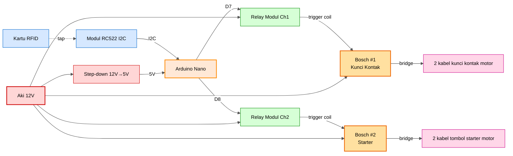

# Wiring Lengkap — SIKAMOT (Sistem Keamanan Motor)

Dokumentasi wiring untuk sketch `motor_starter.ino`.
Pasang ke **motor asli** (12V), bukan simulasi LED.

---

## Daftar Komponen

| No | Komponen | Qty | Keterangan |
|---|---|---|---|
| 1 | Arduino Nano | 1 | Otak sistem |
| 2 | Modul RFID RC522 I2C V1.1 | 1 | NET-0061 |
| 3 | Kartu/Keychain RFID 13.56 MHz | 2 | 1 utama, 1 cadangan |
| 4 | Modul Relay 2-Channel 5V | 1 | Aktif LOW |
| 5 | **Relay Otomotif Bosch 5-pin 40A** | **2** | **#1 untuk kunci kontak, #2 untuk starter** |
| 6 | Diode 1N4007 | 2 | Flyback diode (1 per relay Bosch) |
| 7 | Fuse 30A + holder | 1 | Proteksi jalur utama dari aki |
| 8 | Step-down 12V → 5V | 1 | Power supply Nano dari aki |
| 9 | Kabel otomotif AWG 18-22 | secukupnya | Untuk jalur sinyal & coil Bosch |
| 10 | Kabel otomotif AWG 10-12 | secukupnya | Untuk jalur starter (arus besar) |
| 11 | Heat-shrink tube, isolasi | — | Pelindung sambungan |
| 12 | Boks plastik/akrilik | 1 | Casing Nano + relay |

---

## Diagram Blok Sistem



---

## Tabel Wiring Lengkap

### 1. Power Supply Nano (Step-down 12V → 5V)

| Dari | Ke | Warna Kabel (saran) | Catatan |
|---|---|---|---|
| Aki 12V (+) **via fuse 30A** | Step-down VIN+ | Merah | Wajib pakai fuse |
| Aki 12V (−) / chassis ground | Step-down VIN− | Hitam | — |
| Step-down VOUT+ (5V) | Nano pin **5V** | Merah kecil | Set output step-down ke 5.0V |
| Step-down VOUT− (GND) | Nano pin **GND** | Hitam kecil | — |

> Atau pakai USB powerbank untuk testing — colok ke port mini-USB Nano.

---

### 2. RFID RC522 I2C → Nano

| Pin RFID | Pin Nano | Warna Kabel | Jalur |
|---|---|---|---|
| **3.3V** | **3.3V** | Merah | Pendek, langsung ke Nano |
| **GND** | **GND** | Hitam | Pendek, langsung ke Nano |
| **RST** | **D9** | Kuning | Pendek |
| **SCL** | **A5** | Hijau | Pendek |
| **SDA** | **A4** | Biru | Pendek |
| **IRQ** | (kosong) | — | Tidak dipakai |

> ⚠️ RFID power = **3.3V**, bukan 5V. Posisikan modul di tempat yang mudah ditap (misal di dekat speedometer atau jok).

---

### 3. Modul Relay 2-Channel → Nano

| Pin Relay | Pin Nano | Warna Kabel |
|---|---|---|
| **VCC** | **5V** | Merah |
| **GND** | **GND** | Hitam |
| **IN1** | **D7** | Putih (Kunci Kontak) |
| **IN2** | **D8** | Abu-abu (Starter Trigger) |

---

### 4. Output Relay Modul Channel 1 → Trigger Bosch #1 (Kunci Kontak)

Cascade: relay modul nggak langsung ke motor — dia cuma trigger coil Bosch #1.

| Dari | Ke | Warna Kabel | Catatan |
|---|---|---|---|
| Aki 12V (+) **setelah fuse** | **COM1** modul | Merah | Sumber 12V untuk trigger |
| **NO1** modul | Bosch #1 pin **86** (coil +) | Kuning | Sinyal trigger ke coil Bosch #1 |
| Bosch #1 pin **85** (coil −) | GND aki / chassis | Hitam | Ground coil |
| **NC1** modul | (kosong) | — | Tidak dipakai |

---

### 5. Output Relay Modul Channel 2 → Trigger Bosch #2 (Starter)

| Dari | Ke | Warna Kabel | Catatan |
|---|---|---|---|
| Aki 12V (+) **setelah fuse** | **COM2** modul | Merah | Sumber 12V untuk trigger |
| **NO2** modul | Bosch #2 pin **86** (coil +) | Kuning | Sinyal trigger ke coil Bosch #2 |
| Bosch #2 pin **85** (coil −) | GND aki / chassis | Hitam | Ground coil |
| **NC2** modul | (kosong) | — | Tidak dipakai |

---

### 6. Output Bosch → Motor (4 Kabel)

**Setiap Bosch jadi saklar pengganti** — menyambung 2 kabel motor yang sudah ada.
Output pin **30 ↔ 87** = bridge / saklar tertutup saat relay aktif.

> Bosch tidak mengalirkan 12V dari aki ke motor — dia cuma **menggantikan fungsi saklar fisik**
> kunci kontak & tombol starter yang sudah ada di motor.

#### 6.1 Bosch #1 — Bridge Kunci Kontak (2 kabel)

Cabut socket kunci kontak fisik motor, sambungkan 2 kabel-nya ke Bosch #1:

| Dari | Ke | Warna Kabel | Catatan |
|---|---|---|---|
| Kabel kunci kontak motor **A** | Bosch #1 pin **30** | Sesuai warna motor | Salah satu sisi switch |
| Kabel kunci kontak motor **B** | Bosch #1 pin **87** | Sesuai warna motor | Sisi lain switch |
| Bosch #1 pin **87a** | (kosong) | — | Tidak dipakai |

> 💡 Kunci kontak motor biasanya cuma punya 2 terminal utama yang **disambungkan** saat kunci ON.

#### 6.2 Bosch #2 — Bridge Tombol Starter (2 kabel)

Cabut socket tombol starter, sambungkan 2 kabel-nya ke Bosch #2:

| Dari | Ke | Warna Kabel | Catatan |
|---|---|---|---|
| Kabel tombol starter **A** | Bosch #2 pin **30** | Sesuai warna motor | Salah satu sisi tombol |
| Kabel tombol starter **B** | Bosch #2 pin **87** | Sesuai warna motor | Sisi lain tombol |
| Bosch #2 pin **87a** | (kosong) | — | Tidak dipakai |

> 💡 Tombol starter motor cuma punya 2 kabel — saat ditekan, dua-duanya terhubung.

---

### 6.3 Bosch Pinout Reference

```
       ┌──────────────┐
       │              │
  85 ──┤  COIL    OUT ├── 87  (NO)
  86 ──┤              ├── 87a (NC, kosong)
       │   SWITCH     │
       │           ▲  │
       └───────────┼──┘
                  30  (COM)
```

| Pin | Fungsi | Sambung ke |
|---|---|---|
| **85** | Coil ground | GND aki |
| **86** | Coil 12V trigger | NO1/NO2 dari relay modul |
| **30** | Saklar COM | Kabel motor A |
| **87** | Saklar NO | Kabel motor B |
| **87a** | Saklar NC | (kosong) |

> Tambahkan **dioda 1N4007** paralel dengan coil Bosch (pin 85 ↔ 86), katoda (garis hitam) ke pin 86. Untuk proteksi spike tegangan saat coil mati. **2 dioda total** karena 2 Bosch.

---

### 7. Ground (Common Ground — WAJIB!)

Semua ground harus disatukan di **1 titik**:

| Komponen | Ground ke |
|---|---|
| Nano GND | Titik ground utama |
| Relay modul GND | Titik ground utama |
| Step-down VOUT− | Titik ground utama |
| Aki 12V (−) | Titik ground utama |
| Chassis motor | Titik ground utama |
| RFID GND | Sudah lewat Nano GND |

> ⚠️ Kalau ground tidak disatukan, sinyal sangat noise dan relay bisa nyala-mati sendiri.

---

## Diagram Skematik (ASCII)

```
   ┌─────────────────┐
   │  AKI MOTOR 12V  │
   │   +         −   │
   └───┬─────────┬───┘
       │         │
   [Fuse 30A]    │
       │         │
       ├─────────┼────────────────────────────────────────┐
       │         │                                        │
       ▼         ▼                                        │
   ┌──────────────────┐                                   │
   │   STEP-DOWN      │                                   │
   │   12V → 5V       │                                   │
   └──┬───────────┬───┘                                   │
      │+5V        │GND                                    │
      ▼           ▼                                       │
   ┌───────────────────────────────────────────────┐      │
   │              ARDUINO NANO                     │      │
   │  5V  GND  3V3  D7  D8  D9  A4  A5             │      │
   └──┬────┬───┬────┬───┬───┬───┬───┬──────────────┘      │
      │    │   │    │   │   │   │   │                     │
      │    │   │    │   │   ▼   ▼   ▼                     │
      │    │   │    │   │  ┌────────────────────┐         │
      │    │   │    │   │  │  RFID RC522 I2C    │         │
      │    │   │    │   │  │  RST  SDA  SCL     │         │
      │    │   │    │   │  │  3.3V─┐  GND─┐     │         │
      │    │   │    │   │  └───────┼──────┼─────┘         │
      │    │   │    │   │          │      │               │
      │    │   │    │   │          (←3V3) (←GND Nano)     │
      │    │   │    ▼   ▼                                 │
      ▼    ▼   │  ┌──────────────────────┐                │
   ┌─────────┐ │  │ RELAY MODUL 2-CH 5V  │                │
   │5V → VCC │ │  │ IN1  IN2  VCC  GND   │                │
   │GND → GND│ │  │ COM1 NO1  COM2 NO2   │                │
   └─────────┘ │  └──┬────┬────┬────┬────┘                │
               │     │    │    │    │                     │
               │     │    │    │    └──► Bosch#2 pin 86   │
               │     │    │    └───────► +12V (via fuse)  │
               │     │    └────────────► Bosch#1 pin 86   │
               │     └─────────────────► +12V (via fuse)  │
               │                                          │
               │  ┌──────────────────────────────────┐    │
               │  │ BOSCH #1 (Kunci Kontak)          │    │
               │  │  86─┐    85─┐    30─┐    87─┐    │    │
               │  └─────┼───────┼──────┼──────┼─────┘    │
               │        │       │      │      │          │
               │     (NO1)  (GND)   (kabel A)(kabel B)    │
               │                    └─ kunci kontak ─┘    │
               │                                          │
               │  ┌──────────────────────────────────┐    │
               │  │ BOSCH #2 (Starter)               │    │
               │  │  86─┐    85─┐    30─┐    87─┐    │    │
               │  └─────┼───────┼──────┼──────┼─────┘    │
               │        │       │      │      │          │
               │     (NO2)  (GND)   (kabel A)(kabel B)    │
               │                    └─ tombol starter ─┘  │
               │                                          │
               └──────────────────────────────────────────┤
                                                          │
                                                  CHASSIS GND
```

---

## Routing Kabel — Jalur Fisik di Motor

| Segmen | Dari | Ke | Saran Jalur |
|---|---|---|---|
| 1 | Aki (+) | Fuse holder | Pendek, dekat aki |
| 2 | Fuse | Step-down + relay modul COM1/COM2 | Via jalur kelistrikan utama |
| 3 | Step-down → Nano | Step-down 5V out | Di dalam boks Nano |
| 4 | Nano → Relay modul | D7, D8, 5V, GND | Di dalam boks |
| 5 | Nano → RFID | A4, A5, D9, 3.3V, GND | Lewat kabel data ke posisi modul (jok/dashboard) |
| 6 | Relay modul NO1 → Bosch #1 pin 86 | Sinyal trigger | Pendek di dalam boks |
| 7 | Relay modul NO2 → Bosch #2 pin 86 | Sinyal trigger | Pendek di dalam boks |
| 8 | Bosch #1 pin 30/87 → 2 kabel kunci kontak motor | Bridge switch | Di area kunci kontak |
| 9 | Bosch #2 pin 30/87 → 2 kabel tombol starter | Bridge switch | Di area stang/setang |
| 10 | Semua GND → chassis | Titik ground utama | Baut chassis (pakai sepatu kabel ring) |

---

## Cara Cari Kabel di Motor

### Kabel Kunci Kontak (2 kabel)

1. Lepas cover kunci kontak fisik motor
2. Cabut soket kunci kontak — terlihat **2 kabel utama** (terminal IGN switch)
3. Pakai **multimeter** mode continuity (beep):
   - Putar kunci ke **OFF** → 2 kabel tidak terhubung (tidak beep)
   - Putar kunci ke **ON** → 2 kabel terhubung (beep)
4. **Itu sepasang kabel target** — sambungkan ke Bosch #1 pin **30** dan **87**
5. **Tidak perlu peduli polaritas** karena ini cuma switch (bridge)

### Kabel Tombol Starter (2 kabel)

1. Lepas tombol starter di stang kanan (biasanya dilepas dari housing)
2. Cabut soketnya — biasanya ada **2 kabel** menuju tombol starter
3. Pakai multimeter mode continuity:
   - Lepas tombol → tidak terhubung
   - Tekan tombol → terhubung (beep)
4. **Itu sepasang kabel target** — sambungkan ke Bosch #2 pin **30** dan **87**
5. Polaritas bebas

> 💡 Backup: **biarkan kunci kontak & tombol starter fisik tetap terpasang**. Bosch bekerja paralel — jadi motor bisa dihidupkan via RFID **ATAU** cara konvensional.

---

## Daftar Periksa Pra-Pasang

- [ ] Semua kabel sudah sesuai panjang yang dibutuhkan (lebih panjang sedikit, jangan terlalu pas)
- [ ] Setiap sambungan disolder, bukan twist + isolasi saja
- [ ] Semua sambungan ditutup heat-shrink
- [ ] Fuse 30A terpasang di jalur (+) utama dari aki
- [ ] Step-down output sudah dicek pakai multimeter = **5.0V ± 0.2V**
- [ ] Polaritas relay benar (VCC tidak ke GND)
- [ ] RFID power di **3.3V**, BUKAN 5V
- [ ] Common ground sudah tersambung di 1 titik
- [ ] Tes manual dulu pakai LED 12V sebagai pengganti starter
- [ ] Test tap kartu 10x — semua respons konsisten
- [ ] Boks Nano + relay diletakkan jauh dari panas mesin
- [ ] Modul RFID terlindung dari hujan/cipratan air

---

## Skenario Pengujian (Sebelum Final)

| No | Aksi | Ekspektasi |
|---|---|---|
| 1 | Colok kabel power | LED PWR Nano nyala, Serial Monitor "Status: OFF" |
| 2 | Tap kartu tidak terdaftar | Serial: "AKSES DITOLAK", relay tetap OFF |
| 3 | Tap kartu terdaftar | Serial: "MOTOR HIDUP", Relay 1 ON, Relay 2 ON 2 detik, kembali OFF |
| 4 | Tap kartu terdaftar lagi | Serial: "MOTOR OFF", Relay 1 OFF |
| 5 | Tap berturut-turut <2 detik | Tap kedua diabaikan (cooldown) |
| 6 | Cabut kabel power saat motor ON | Relay default OFF → motor mati (failsafe OK) |
