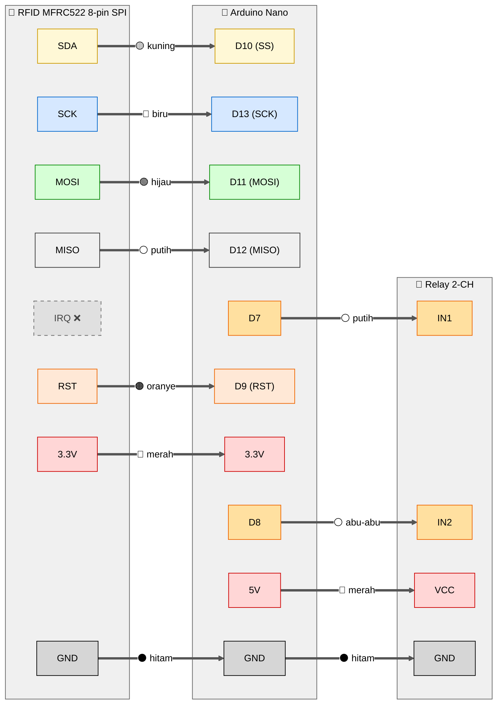

# Wiring Lengkap — SIKAMOT (SPI 8-pin)

Dokumentasi wiring untuk sketch `motor_starter_spi.ino` dengan modul **RFID MFRC522 8-pin SPI**.

---

## Daftar Komponen

| No | Komponen | Qty | Keterangan |
|---|---|---|---|
| 1 | Arduino Nano | 1 | Otak sistem |
| 2 | **Modul RFID MFRC522 8-pin SPI** | 1 | Pin: SDA, SCK, MOSI, MISO, IRQ, GND, RST, 3.3V |
| 3 | Kartu/Keychain RFID 13.56 MHz | 2 | 1 utama, 1 cadangan |
| 4 | Modul Relay 2-Channel 5V | 1 | Aktif LOW |
| 5 | Relay Otomotif Bosch 5-pin 40A | 2 | #1 untuk kunci kontak, #2 untuk starter |
| 6 | Diode 1N4007 | 2 | Flyback (1 per Bosch) |
| 7 | Fuse 30A + holder | 1 | Proteksi jalur utama aki |
| 8 | Fuse 1A + holder | 1 | Proteksi jalur Nano |
| 9 | Step-down 12V → 5V | 1 | Power supply Nano dari aki |
| 10 | Kabel jumper / UTP | secukupnya | — |
| 11 | Heat-shrink tube, isolasi | — | — |
| 12 | Boks plastik/akrilik | 1 | Casing |

---

## Library yang Dipakai

| Library | Status | Catatan |
|---|---|---|
| `MFRC522` by GithubCommunity | ✅ Wajib install | Untuk SPI |
| `SPI.h` | ✅ Bawaan Arduino IDE | Tidak perlu install |
| `MFRC522_I2C` by arozcan | ❌ **Wajib uninstall** | Bentrok dengan MFRC522 SPI |

> ⚠️ Library `MFRC522_I2C` dan `MFRC522` SPI **bentrok nama class** (`MFRC522`).
> Harus pakai salah satu saja dalam 1 waktu. Untuk varian SPI ini, pakai
> `MFRC522 by GithubCommunity`.

---

## Tabel Wiring Lengkap

### 1. RFID MFRC522 8-pin SPI → Arduino Nano

| Pin RFID | Pin Nano | Warna Kabel (saran) | Keterangan |
|---|---|---|---|
| **SDA** | **D10** | Kuning | SS / Chip Select SPI |
| **SCK** | **D13** | Biru | Clock SPI |
| **MOSI** | **D11** | Hijau | Master Out Slave In |
| **MISO** | **D12** | Putih | Master In Slave Out |
| **IRQ** | *(kosong)* | — | Tidak dipakai |
| **GND** | **GND** | Hitam | Ground |
| **RST** | **D9** | Oranye | Reset RFID |
| **3.3V** | **3.3V** ⚠️ | Merah | **JANGAN ke 5V** (modul rusak) |

> 💡 Beda dengan modul I2C 6-pin, modul SPI 8-pin butuh **4 jalur sinyal data**
> (SDA, SCK, MOSI, MISO). Lebih banyak kabel tapi lebih reliable untuk jarak panjang.

---

### 2. Relay Module 2-Channel → Arduino Nano

| Pin Relay | Pin Nano | Warna Kabel | Keterangan |
|---|---|---|---|
| **VCC** | **5V** | Merah | Power coil |
| **GND** | **GND** | Hitam | Ground |
| **IN1** | **D7** | Putih | Sinyal Kunci Kontak |
| **IN2** | **D8** | Abu-abu | Sinyal Starter |

---

### 3. Power Supply Nano (Step-down 12V → 5V)

| Dari | Ke | Catatan |
|---|---|---|
| Aki 12V (+) **via fuse 1A** | Step-down VIN+ | Khusus jalur Nano |
| Aki 12V (−) | Step-down VIN− | — |
| Step-down VOUT+ | Nano pin **5V** | Set output ke 5.0V via trimmer |
| Step-down VOUT− | Nano pin **GND** | — |

---

### 4. Relay Modul Ch1 → Bosch #1 (Kunci Kontak)

| Dari | Ke | Catatan |
|---|---|---|
| Aki 12V (+) via fuse 30A | **COM1** modul | Sumber 12V trigger |
| **NO1** modul | Bosch #1 pin **86** (coil +) | Sinyal coil |
| Bosch #1 pin **85** (coil −) | GND aki | Ground coil |

### 5. Relay Modul Ch2 → Bosch #2 (Starter)

| Dari | Ke | Catatan |
|---|---|---|
| Aki 12V (+) via fuse 30A | **COM2** modul | Sumber 12V trigger |
| **NO2** modul | Bosch #2 pin **86** (coil +) | Sinyal coil |
| Bosch #2 pin **85** (coil −) | GND aki | Ground coil |

### 6. Bosch Output → 4 Kabel Motor

#### Bosch #1 — Bridge Kunci Kontak

| Dari | Ke | Catatan |
|---|---|---|
| Kabel kunci kontak motor **A** | Bosch #1 pin **30** | Salah satu sisi switch |
| Kabel kunci kontak motor **B** | Bosch #1 pin **87** | Sisi lain switch |

#### Bosch #2 — Bridge Tombol Starter

| Dari | Ke | Catatan |
|---|---|---|
| Kabel tombol starter **A** | Bosch #2 pin **30** | Salah satu sisi tombol |
| Kabel tombol starter **B** | Bosch #2 pin **87** | Sisi lain tombol |

---

## Diagram Wiring (Mermaid)



---

## Skematik ASCII

```
                  ┌──────────────────────┐
                  │  RFID MFRC522 SPI    │
                  │     8-pin module     │
                  │                      │
                  │  SDA  SCK  MOSI MISO │
                  │   │    │    │    │   │
                  │  IRQ  GND  RST  3.3V │
                  │   │    │    │    │   │
                  └───┼────┼────┼────┼───┘
                      │    │    │    │
                      X    │    │    │   (IRQ tidak dipakai)
                           │    │    │
                           ▼    ▼    ▼
                          GND  D9   3.3V
                                              ┌──────────────┐
                  SDA  ──────────────► D10 ───┤              │
                  SCK  ──────────────► D13 ───┤              │
                  MOSI ──────────────► D11 ───┤ Arduino Nano │
                  MISO ──────────────► D12 ───┤              │
                                              │              │
                                          D7──┤              │
                                          D8──┤              │
                                          5V──┤              │
                                          GND─┤              │
                                              └──────────────┘
                                              │   │   │   │
                                              ▼   ▼   ▼   ▼
                                            IN1 IN2 VCC GND
                                              │   │   │   │
                                          ┌───┴───┴───┴───┴───┐
                                          │  Relay 2-CH 5V    │
                                          │  NO1 COM1 NO2 COM2│
                                          └──┬───┬────┬───┬───┘
                                             │   │    │   │
                                          ... ke cascade Bosch ...
```

---

## Ringkasan Pin Nano Terpakai

| Pin Nano | Dipakai Untuk | Group |
|---|---|---|
| **D7** | IN1 Relay (Kunci Kontak) | Output digital |
| **D8** | IN2 Relay (Starter) | Output digital |
| **D9** | RST RFID | Output digital |
| **D10** | SDA RFID (SS SPI) | SPI |
| **D11** | MOSI RFID | SPI |
| **D12** | MISO RFID | SPI |
| **D13** | SCK RFID | SPI |
| **3.3V** | Power RFID | Power |
| **5V** | Power Relay Modul + COM Relay (untuk trigger Bosch) | Power |
| **GND** | Ground bersama | Power |

**Pin sisa yang masih kosong:** D0, D1 (jangan!), D2, D3, D4, D5, D6, A0-A7.

---

## ⚠️ Catatan SPI vs I2C

| Aspek | SPI (8-pin) | I2C (6-pin) |
|---|---|---|
| Pin Nano dipakai | 7 pin (D9-D13 + 3.3V + GND) | 5 pin (D9, A4, A5, 3.3V, GND) |
| Reliability jarak jauh | ⭐⭐⭐⭐ (lebih baik) | ⭐⭐ (perlu pull-up untuk >1m) |
| Speed | Sampai 10 Mbps | 100-400 kHz |
| Pin Nano tersisa | Lebih sedikit | Lebih banyak |
| Library | `MFRC522` by GithubCommunity | `MFRC522_I2C` by arozcan |

---

## Cara Pakai

1. **Install library MFRC522 (SPI)** dari Library Manager
2. **Uninstall MFRC522_I2C** kalau ada (bentrok nama class)
3. Buka `motor_starter_spi.ino` di Arduino IDE
4. Set Board: Arduino Nano, Processor: ATmega328P (Old Bootloader), Port: COMx
5. Upload
6. Buka Serial Monitor (9600), tap kartu untuk dapat UID
7. Ganti UID di `allowedUIDs[]` sesuai kartu kamu
8. Upload ulang
9. Tes tap → motor ON → tap lagi → motor OFF

## Cara Cari Kabel di Motor

Sama seperti di `motor_starter/WIRING.md`:

### Kabel Kunci Kontak (2 kabel)
1. Lepas cover kunci kontak fisik
2. Multimeter mode continuity → cari 2 kabel yang nyambung saat kunci ON
3. Sambungkan ke Bosch #1 pin 30 dan 87

### Kabel Tombol Starter (2 kabel)
1. Lepas tombol starter di stang
2. Multimeter continuity → cari 2 kabel yang nyambung saat tombol ditekan
3. Sambungkan ke Bosch #2 pin 30 dan 87

> 💡 Biarkan kunci kontak & tombol fisik tetap terpasang — sistem RFID jalan
> paralel, jadi motor bisa dihidupkan via RFID **ATAU** cara konvensional.
