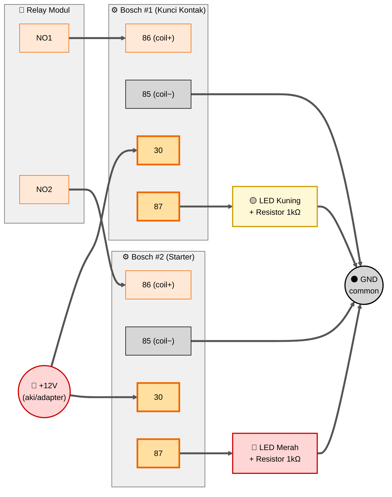

# Wiring Simulasi Starter (LED) — SIKAMOT

Panduan ini untuk **tes kerja sistem sebelum dipasang ke motor asli**.
Output Bosch (yang seharusnya bridge ke kabel motor) diganti dengan
LED + resistor supaya bisa diverifikasi secara visual.

---

## Tujuan Simulasi

- ✅ Verifikasi cascade: Relay Modul → Bosch coil → Bosch contact
- ✅ Cek timing: kunci kontak ON dulu, baru starter crank 2 detik
- ✅ Cek toggle: tap = ON, tap lagi = OFF
- ✅ Mantapkan rangkaian sebelum dipasang ke motor (mengurangi risiko salah kabel di motor asli)

---

## Yang Berubah dari Wiring Asli

**Tidak ada wiring yang dihapus** — semua wiring `motor_starter.ino` tetap dipakai.
Cuma **menambah komponen di output Bosch** (pin 30 & 87).

| Bagian | Wiring Asli | Wiring Simulasi |
|---|---|---|
| RFID → Nano | ✅ Tetap | ✅ Sama |
| Relay Modul → Nano | ✅ Tetap | ✅ Sama |
| Modul NO1/NO2 → Bosch coil (86) | ✅ Tetap | ✅ Sama |
| Bosch coil 85 → GND aki | ✅ Tetap | ✅ Sama |
| Bosch 30 ← +12V | ⚠️ (dari aki untuk pakai motor) | **+12V dari aki/adapter** |
| Bosch 87 → ? | 2 kabel motor (kunci kontak/starter) | **→ Resistor → LED → GND** |

---

## Komponen Tambahan untuk Simulasi

| Komponen | Qty | Catatan |
|---|---|---|
| LED 5mm kuning | 1 | Simulasi "kunci kontak ON" |
| LED 5mm merah | 1 | Simulasi "starter cranking" |
| Resistor 1kΩ (1/4W) | 2 | Limiter arus untuk LED di 12V |
| Supply 12V | 1 | **Aki motor** atau **adapter 12V 1A** |
| Breadboard / project board | 1 | Buat ngerangkai LED |
| Kabel jumper | secukupnya | — |

> Kalau **tidak punya supply 12V**, lihat **opsi simulasi cepat** di bagian akhir.

---

## Tabel Wiring Tambahan

### LED Kuning (Simulasi Kunci Kontak)

| Dari | Ke | Komponen |
|---|---|---|
| +12V (aki/adapter) | Bosch #1 pin **30** | — |
| Bosch #1 pin **87** | LED Kuning (+) anoda | **Resistor 1kΩ** di antaranya |
| LED Kuning (−) katoda | GND aki / GND Nano | — |

### LED Merah (Simulasi Starter)

| Dari | Ke | Komponen |
|---|---|---|
| +12V (aki/adapter) | Bosch #2 pin **30** | — |
| Bosch #2 pin **87** | LED Merah (+) anoda | **Resistor 1kΩ** di antaranya |
| LED Merah (−) katoda | GND aki / GND Nano | — |

---

## Diagram Wiring Simulasi



---

## Diagram Skematik ASCII

```
   +12V (aki/adapter)
       │
       ├──────────────────┐
       │                  │
       ▼                  ▼
   ┌─────────────┐    ┌─────────────┐
   │ Bosch #1    │    │ Bosch #2    │
   │             │    │             │
   │  30 ──┐     │    │  30 ──┐     │
   │       │     │    │       │     │
   │  87 ──┤     │    │  87 ──┤     │
   │       │     │    │       │     │
   │  86 ◄─┼─NO1 │    │  86 ◄─┼─NO2 │
   │  85 ──┤     │    │  85 ──┤     │
   └───────┼─────┘    └───────┼─────┘
           │                  │
           ▼                  ▼
       [1kΩ]              [1kΩ]
           │                  │
           ▼                  ▼
        ┌─────┐            ┌─────┐
        │ 🟡  │            │ 🔴  │  LED
        │ LED │            │ LED │
        └──┬──┘            └──┬──┘
           │                  │
           └──────┬───────────┘
                  │
                  ▼
               GND
              (sama dengan GND Nano dan GND aki)
```

---

## Skenario Pengujian

Upload `simulasi-starter.ino`, buka Serial Monitor (9600 baud), lalu tes:

| No | Aksi | Ekspektasi |
|---|---|---|
| 1 | Power ON | Serial: "Status: OFF", semua LED **mati** |
| 2 | Tap kartu tidak terdaftar | Serial: "AKSES DITOLAK", LED tetap mati |
| 3 | Tap kartu terdaftar (state OFF) | LED kuning **nyala** → tunggu 500ms → LED merah **nyala 2 detik** → LED merah **mati** → LED kuning tetap nyala |
| 4 | Tap kartu terdaftar (state ON) | LED kuning + LED merah **mati semua** |
| 5 | Tap berturut-turut <2 detik | Tap kedua diabaikan (cooldown), LED tidak berubah |
| 6 | Cabut power Nano saat state ON | Semua LED mati (failsafe OK) |

### Visual Timeline (Tap saat state OFF)

```
Waktu (s):   0      0.5     2.5     ...
            │       │       │
LED Kuning: ██████████████████████  (nyala terus sampai tap lagi)
LED Merah:  ......██████████.......  (nyala 0.5-2.5, lalu mati)
```

---

## Troubleshooting

| Gejala | Penyebab | Solusi |
|---|---|---|
| LED tidak menyala sama sekali | Polaritas LED kebalik | Cek anoda (+, kaki panjang) ke Bosch 87 |
| LED redup banget | Resistor terlalu besar | Kalau pakai 5V, resistor 220Ω; kalau 12V, 1kΩ |
| LED nyala TERUS (tidak mati) | Polaritas NC, bukan NO | Pastikan pakai pin **87** (NO), bukan 87a |
| Bosch tidak klik saat tap kartu | Coil tidak dapat 12V | Cek wiring NO1→pin86 dan 85→GND aki |
| Klik Bosch terdengar tapi LED tetap mati | Sambungan 30 ke +12V putus | Cek koneksi +12V → pin 30 |
| Relay modul indicator nyala tapi Bosch diam | Voltage drop relay modul, atau coil Bosch tidak kontak | Cek tegangan di pin 86 saat ON harus ≈12V |

---

## Opsi Simulasi Cepat (Tanpa 12V, Tanpa Bosch)

Kalau cuma mau tes **logic Nano + Relay Modul** (tanpa Bosch sama sekali):

1. **Cabut wiring Bosch** dari relay modul (lepaskan kabel NO1 & NO2)
2. Tidak perlu supply 12V — cuma USB Nano
3. Lihat **LED indicator yang sudah ada di modul relay** (biasanya nyala saat IN aktif)

| LED Modul | Status saat tap kartu valid |
|---|---|
| IN1 indicator | Nyala → tetap nyala (kunci kontak) |
| IN2 indicator | Nyala 2 detik → mati (starter crank) |

Cara ini cukup buat verifikasi logic kode tanpa hardware tambahan. Tapi tidak menguji cascade Bosch.

---

## Setelah Simulasi Sukses

Lepas LED + resistor + 12V test, lalu sambungkan output Bosch ke kabel motor sesuai
panduan di `motor_starter/WIRING.md` section 6.1 dan 6.2.

Kode `.ino` boleh tetap pakai `simulasi-starter.ino` atau ganti ke `motor_starter.ino`
(keduanya identik secara logic — beda hanya komentar header).
